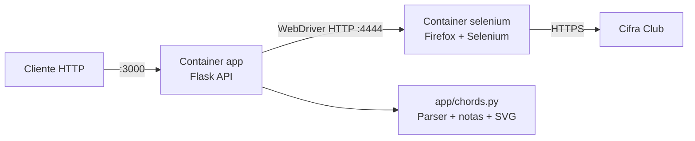
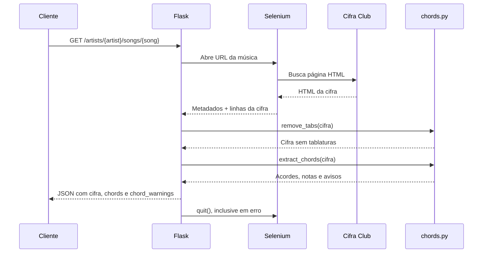

# Arquitetura Atual

A aplicação é uma API Flask monolítica executada em Docker. O Selenium roda em
um container separado e é usado apenas para acessar o Cifra Club.

## Implantação



## Fluxo da cifra



## Fluxo do diagrama SVG

```mermaid
flowchart LR
    C[Cliente] -->|GET /chords/diagram.svg?name=C%23m7| A[Flask]
    A --> K[keyboard_svg(name)]
    K --> SVG[SVG em memória]
    SVG --> C
```

## Componentes

- `app/api.py`: rotas Flask e serialização da resposta.
- `app/cifraclub.py`: Selenium, BeautifulSoup e extração da página externa.
- `app/chords.py`: remoção de tablaturas, extração, interpretação e SVG.
- `app/test_chords.py`: testes unitários do parser, sem Selenium.
- `docker-compose.yml`: rede local entre API e Selenium.

Não há banco de dados, frontend, autenticação, cache ou arquivos SVG persistidos.
